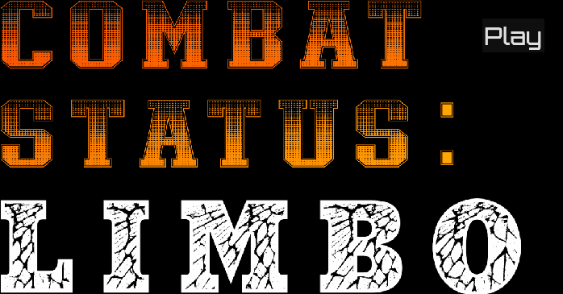

# Upset Ned
## Combat Status: Limbo

Shooty bang bang





## Multiplayer scaffolding
The way Godot does multiplayer is super streamlined but it feels clunky to me. It seems to force you into a lot of conditionals throughout your code to check if you are on the server or on the client. Or maybe I just don't really understand the authority server pattern that much yet. In any case, this game is multiplayer and I want to have a clear separation between the dedicated server running on a ubuntu box somewhere and the client running on an end users computer.

I also want to have a server browser eventually, and I want the server to tell the client which map to load when it connects. I also want to isolate the RPC calls as much as I can so that the conditionals for ie `multiplayer.is_server()` are as far away from the application code as I can get them. For all these reasons I am trying out a bootstrapping system thus:

### Main.tscn
This is the entrypoint for the application, and exists for the life of the session. It has a mount point for us to load maps onto, and contains some nodes to assist in the bootstrapping and connecting of servers and clients.

### ServerBootstrapper.gd
When Main.gd sees it is operating in headless mode, it calls ServerBootstrapper.boot. This requires a --map launch arg which tells the server which map to load.

### ClientBootstrapper.gd
When Main.gd sees that it is _not_ in headless mode, it routes the player to the main menu. The user can join a server using a server browser (eventually) and the ClientBootstrapper then connects to that server.

### Network.gd
When the client connects to a server, the server tells the client to load the map. This is done via an RPC call and that RPC call lives in Network.gd. The idea is that, since Godot requires RPC methods to exist on both the server and the client, the Network script will be the central place that mediates all those calls.

I'm hoping this system will give us a bunch of advantages, namely:
 - Allowing servers to tell clients which map to load
 - Allowing servers to tell clients to load community-created maps using ResourceLoader and .pck files
 - Encouraging devs (me) to separate out networky stuff from shooty stuff

## Dedicated Server Ubuntu Install
### Build and upload server files
Installing the server to `/opt/combat-status-limbo-dedicated-server` on the ubuntu host so this means build the dedicated server locally and then upload the files to that directory on the server. You should copy up these files:
```
libdd3d.linux.editor.x86_64.so
UpsetNed.pck
UpsetNed.sh
UpsetNed.x86_64
```
### Adding a server user
Add a new user to run the server ("combatstatuslimboserveruser")
```
sudo useradd --system --home /opt/combat-status-limbo-dedicated-server --shell /usr/sbin/nologin combatstatuslimboserveruser
```
Give that user permissions over the server
```
sudo chown -R combatstatuslimboserveruser:combatstatuslimboserveruser /opt/combat-status-limbo-dedicated-server
```
Make the server executable
```
chmod +x /opt/combat-status-limbo-dedicated-server/UpsetNed.x86_64
```
### Create a systemd service
Create the ocnfiguration file: `sudo nano /etc/systemd/system/combat-status-limbo-dedicated-server.service`:
contents:
```
[Unit]
Description=Combat Status: Limbo Godot Dedicated Server
After=network.target

[Service]
Type=simple
User=combatstatuslimboserveruser
Group=combatstatuslimboserveruser
WorkingDirectory=/opt/combat-status-limbo-dedicated-server

ExecStart=/opt/combat-status-limbo-dedicated-server/UpsetNed.x86_64 \
  --headless \
  --server \
  --port 9043 \
  --map=Docks/Docks \
  --mode=server

Restart=always
RestartSec=2

# hard limits so it doesn’t explode silently
LimitNOFILE=65535

[Install]
WantedBy=multi-user.target
```
^ note the `User`, `Group`, `WorkingDirectory` and flags on `ExecStart`
Reload to pick up the config:
```
sudo systemctl daemon-reload
```
Use systemd to start the service:
```
sudo systemctl start combat-status-limbo-dedicated-server
```
And enable it to run on boot:
```
sudo systemctl enable combat-status-limbo-dedicated-server
```
If you have issues, check status:
```
systemctl status combat-status-limbo-dedicated-server
```
Tail logs:
```
journalctl -u combat-status-limbo-dedicated-server -f
```
## Open ports to the server
The port will be used by clients to connect to the server and will be unique to each server instance
```
sudo ufw allow 9043/tcp
sudo ufw allow 9043/udp
```
## Reuploading changed binaries
Down the service first:
```
sudo systemctl stop combat-status-limbo-dedicated-server
```
then upload the new files and then restart the server:
```
sudo systemctl start combat-status-limbo-dedicated-server
```
## Setting up caddy to run the websockets server to route from client to godot at 4093
https://caddyserver.com/docs/install#debian-ubuntu-raspbian
```
sudo apt install -y debian-keyring debian-archive-keyring apt-transport-https curl
curl -1sLf 'https://dl.cloudsmith.io/public/caddy/stable/gpg.key' | sudo gpg --dearmor -o /usr/share/keyrings/caddy-stable-archive-keyring.gpg
curl -1sLf 'https://dl.cloudsmith.io/public/caddy/stable/debian.deb.txt' | sudo tee /etc/apt/sources.list.d/caddy-stable.list
chmod o+r /usr/share/keyrings/caddy-stable-archive-keyring.gpg
chmod o+r /etc/apt/sources.list.d/caddy-stable.list
sudo apt update
sudo apt install caddy
```
then create a caddyfile at `/etc/caddy/Caddyfile` with contents like:
```
csl.turtlegully.com
reverse_proxy localhost:9043
```
then restart caddy:
```
sudo systemctl restart caddy
```
That just routes websockets traffic over an ssl-secured connection to the godot server running on 9043. You need your own domain for this to work properly.
